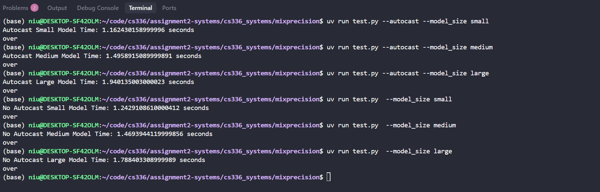
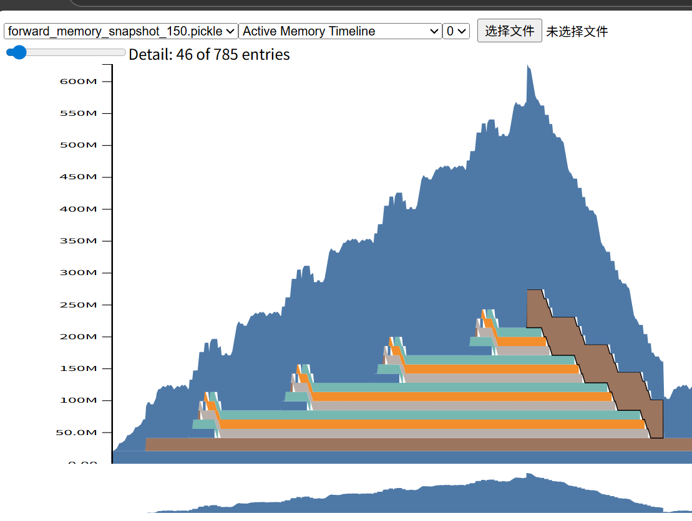

# 1、Compare the runtime of the softmax operation versus the matrix multiplication operations within the self-attention layer of your model during a forward pass. How does the difference in runtimes compare to the difference in FLOPs?

答：Flops不能完全代表计算量，因为机器运行的时候不是一直在算算算，还有io、同步异步等其他的操作，如果我们的Q矩阵和K矩阵是M *M 
所以
$$
MatrixMultiply\_Flops = 2 M ^3
$$
而softmax每一个元素主要进行取指数，求和加法和除法三个操作，flops可以简写为：
$$
MatrixMultiply\_Flops = 3 L * L
$$
我在实验的时候，M是512，L是256，所以倍数是：
$$
    2 * 512^3 / 3 * 256 * 256 = 1365倍
$$
但是实际用nsys profile测出来的时间倍数是2倍多一点。


# 二、Profile running one complete training step with your implementation of AdamW (i.e., the forwardpass, computing the loss and running a backward pass, and finally an optimizer step, as you’d do during training). How does the fraction of time spent on matrix multiplication change, compared to doing inference (forward pass only)? How about other kernels


里面算子最多的就是 ampere_sgemm_128x64_tn 分块矩阵的乘法应该是用到这个 128 * 64的小矩阵的乘法了，tn表示前面的转置了，后面的没有转置（有可能相反，猜想可能是qt^T）两个过程差不多


# 三、Although the vast majority of FLOPs take place in matrix multiplications, you will notice that several other kernels still take a non-trivial amount of the overall runtime. What other kernels besides matrix multiplies do you see accounting for non-trivial CUDA runtime in the forward pass?
```
  void at::native::elementwise_kernel<(int)128, (int)2, void at::native::gpu_kernel_impl_nocast<at::n…
  void at::native::elementwise_kernel<(int)128, (int)2, void at::native::gpu_kernel_impl_nocast<at::n…
  void at::native::vectorized_elementwise_kernel<(int)4, at::native::exp_kernel_cuda(at::TensorIterat…
```
上面三个kernel 函数是出了128* 64之外调用最多的函数，他们都是c++函数。
elementwise_kernel表示的是逐元素的操作, 隶属于at（Aten命名空间下native子命名空间）的一个算子函数，这是一个模板，我们可以输入不同的参数控制并行的规模，（int)128表示的是启动128个线程，（int）表示每一个线程处理两个元素，后面是对每一个元素的具体操作（学过c++模板函数应该非常熟悉）。

vectorized_elementwise_kernel是处理每一个向量，比如可以一次性处理4到8个元素这样子的，它执行的函数是exp_kernel_cuda，很有可能是softmax中间需要的。

# 四、What CUDA kernel takes the most cumulative GPU time during the forward pass? How many times is this kernel invoked during a single forward pass of your model? Is it the same kernel that takes the most runtime when you do both forward and backward passes? (Hint: look at the “CUDA GPU Kernel Summary” under “Stats Systems View”, and filter using NVTX ranges to identify which parts of the model are responsible for which kernels.)
可以看到都是ampere_sgemm_128x64_tn算子，这个矩阵乘法算子占了大头


# 五、You should have seen that FP16 mixed precision autocasting treats the layer normalization layer differently than the feed-forward layers. What parts of layer normalization are sensitive to mixed precision? If we use BF16 instead of FP16, do we still need to treat layer normalization differently? Why or why not?
layernorm 应该是可以用bf16的，毕竟我想了一下，layernorm里面一共三个操作，求和，减法和除法。bf16和fp32表示的范围是一样的，所以加法和除法没问题，减法得到的值肯定比梯度大，出问题的概率较小，但查了许多资料，还是强制使用fp32保证训练的稳定性。

# 六、Modify your benchmarking script to optionally run the model using mixed precision with BF16. Time the forward and backward passes with and without mixed-precision for each language model size described in §1.1.2. Compare the results of using full vs. mixed precision, and comment on any trends as model size changes. You may find the nullcontext no-op context manager to be useful



```python
from contextlib import nullcontext
cm = autocast(device='cuda', dtype=torch.bfloat16) if use_mixed_precision else nullcontext()
with cm:
    # run model forward/backward

```

# 七、Add an option to your profiling script to run your model through the memory profiler. It may be helpful to reuse some of your previous infrastructure (e.g., to activate mixed-precision, load specific model sizes, etc). Then, run your script to get a memory profile of the 2.7B model when either doing inference only (just forward pass) or a full training step. How do your memory timelines look like? Can you tell which stage is running based on the peaks you see?
我们观察到的样子是：我做了三次前向传播，这个图就显示了三次的山峰；反向传播也大概是三座山峰，但是许多中间变量的在显存上的时间变长了（胖的山）
随着transformerLM第51行（对于我的代码） output = self.lm_head(x)的结束，显存分配出现了几个快速峰值(山峰), 然后就开始反向传播了

# 八、What is the peak memory usage of each context length when doing a forward pass? What about when doing a full training step?
我使用了下面的模型：
```
model = NiuTransformerLM(10000,
                                256,
                                512,
                                4,
                                16,
                                1344,
                                10000,
                                device="cuda")
dummy_data = torch.randint(0, 10000, (10, args.context_length)).to("cuda")
```
分别对于输入context_length =100，150和200做了实验：得到下面的表格：
| 长度   | 前向显存 | 整体显存 |
|--------|------|----------|
| 100    | 420M   |   675M |
| 150    | 625M   |   935M |
| 200    | 890M   |   1.2G  |


# 九、Find the peak memory usage of the 2.7B model when using mixed-precision, for both a forward pass and a full optimizer step. Does mixed-precision significantly affect memory usage?

在整体训练中，使用混合精度，最大显存占比从 1.2G 降为 975M；
对于前向传播，最大显存从 890M降为 690M， 确实能够降低显存占用

# 十、Consider the 2.7B model. At our reference hyperparameters, what is the size of a tensor of activations in the Transformer residual stream, in single-precision? Give this size in MB (i.e.,divide the number of bytes by 10242).
感觉就是计算ffn和atten的激活值的大小。
这里计算十分的复杂，但是方法是一样的，这里我们就以ffn模块为例子，计算一下激活值的大小：
模块的主要结构如下：
```python
class NIUSWIGLUFFN(nn.Module):
    def __init__(self,d_model:int,d_ff:int,device = None, dtype = None):
        super(NIUSWIGLUFFN, self).__init__()
        self.d_model = d_model
        self.d_ff = d_ff
        self.device = device
        self.dtype = dtype
        
        self.w1 = NIULinear(d_model, d_ff, device = device, dtype = dtype)
        self.w2 = NIULinear(d_ff, d_model, device = device, dtype = dtype)
        self.w3 = NIULinear(d_model, d_ff, device = device, dtype = dtype)
        
    def forward(self, x: torch.Tensor) -> torch.Tensor:
        assert x.device == self.w1.weight.device
        assert x.device == self.w2.weight.device
        assert x.device == self.w3.weight.device
        a = self.w1(x)
        b = NIUSiLU()(a)
        
        c = self.w3(x)
        
        bc = b * c
        return self.w2(bc)
```
本质上我们需要求w1,w2,w3三个张量的梯度，所以是他们三个的激活值。
对于w1，由a = self.w1(x)是和x相乘，所以激活值和x张量大小一致，是：B * L * H；
对于w2，由 self.w2(bc) 是和bc，而bc大小是：B * L * MH
对于w3，由c = self.w3(x) ，显而易见，激活值的大小是 ：B * L * H；

对于B = 10， L = 200， H = 512， MH = 1344的设定来说， 精度是fp32，4字节
ffn总的激活大小是： 10 * 200 * （2 * 512 + 1344）* 4 / 1024/ 1024 = 18.07MB
# 十一、Now look closely at the “Active Memory Timeline” from pytorch.org/memory_viz of a memory snapshot of the 2.7B model doing a forward pass. When you reduce the “Detail” level, the tool hides the smallest allocations to the corresponding level (e.g., putting “Detail” at 10% only shows 8 the 10% largest allocations). What is the size of the largest allocations shown? Looking through the stack trace, can you tell where those allocations come from?


上面分配显存最大的是在transformerLM最后一个 output = self.lm_head(x)模块，这个模块将隐藏层维度映射为字典大小
一共占了57.2MiB

善后可以看到有四个小尖尖，这是前向传播经过四层。
并且每一个尖尖对应三个条带，然后我仔细地看了一下，按照时间先后顺序分表表示多的是exp操作分配地张量13.7MiB，exp操作分配地张量13.7MiB，然后张量除法分配地显存13.7MiB。
有点感慨，我自己写的简单一行代码居然需要申请三次显存。


