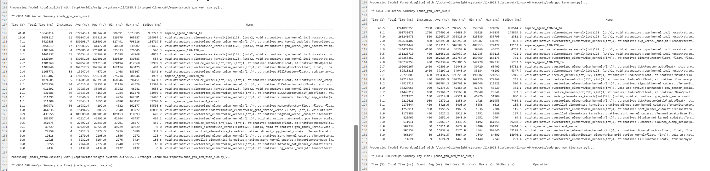

# 1、Compare the runtime of the softmax operation versus the matrix multiplication operations within the self-attention layer of your model during a forward pass. How does the difference in runtimes compare to the difference in FLOPs?

答：Flops不能完全代表计算量，因为机器运行的时候不是一直在算算算，还有io、同步异步等其他的操作，如果我们的Q矩阵和K矩阵是M *M 
所以
$$
MatrixMultiply\_Flops = 2 M ^3
$$
而softmax每一个元素主要进行取指数，求和加法和除法三个操作，flops可以简写为：
$$
MatrixMultiply\_Flops = 3 L * L
$$
我在实验的时候，M是512，L是256，所以倍数是：
$$
    2 * 512^3 / 3 * 256 * 256 = 1365倍
$$
但是实际用nsys profile测出来的时间倍数是2倍多一点。


# 二、Profile running one complete training step with your implementation of AdamW (i.e., the forwardpass, computing the loss and running a backward pass, and finally an optimizer step, as you’d do during training). How does the fraction of time spent on matrix multiplication change, compared to doing inference (forward pass only)? How about other kernels


里面算子最多的就是 ampere_sgemm_128x64_tn 分块矩阵的乘法应该是用到这个 128 * 64的小矩阵的乘法了，tn表示前面的转置了，后面的没有转置（有可能相反，猜想可能是qt^T）两个过程差不多


# 三、Although the vast majority of FLOPs take place in matrix multiplications, you will notice that several other kernels still take a non-trivial amount of the overall runtime. What other kernels besides matrix multiplies do you see accounting for non-trivial CUDA runtime in the forward pass?
```
  void at::native::elementwise_kernel<(int)128, (int)2, void at::native::gpu_kernel_impl_nocast<at::n…
  void at::native::elementwise_kernel<(int)128, (int)2, void at::native::gpu_kernel_impl_nocast<at::n…
  void at::native::vectorized_elementwise_kernel<(int)4, at::native::exp_kernel_cuda(at::TensorIterat…
```
上面三个kernel 函数是出了128* 64之外调用最多的函数，他们都是c++函数。
elementwise_kernel表示的是逐元素的操作, 隶属于at（Aten命名空间下native子命名空间）的一个算子函数，这是一个模板，我们可以输入不同的参数控制并行的规模，（int)128表示的是启动128个线程，（int）表示每一个线程处理两个元素，后面是对每一个元素的具体操作（学过c++模板函数应该非常熟悉）。

vectorized_elementwise_kernel是处理每一个向量，比如可以一次性处理4到8个元素这样子的，它执行的函数是exp_kernel_cuda，很有可能是softmax中间需要的。

# 四、What CUDA kernel takes the most cumulative GPU time during the forward pass? How many times is this kernel invoked during a single forward pass of your model? Is it the same kernel that takes the most runtime when you do both forward and backward passes? (Hint: look at the “CUDA GPU Kernel Summary” under “Stats Systems View”, and filter using NVTX ranges to identify which parts of the model are responsible for which kernels.)
可以看到都是ampere_sgemm_128x64_tn算子，这个矩阵乘法算子占了大头

